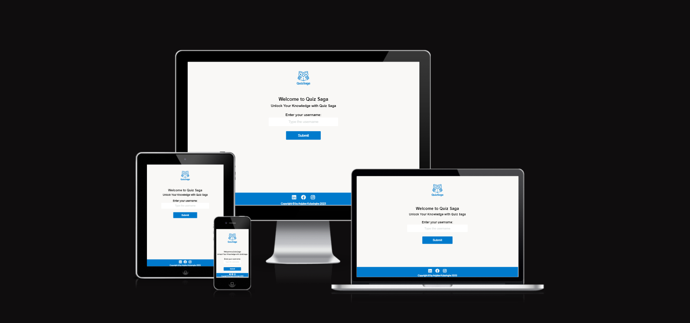
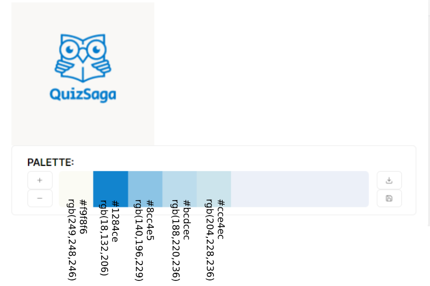
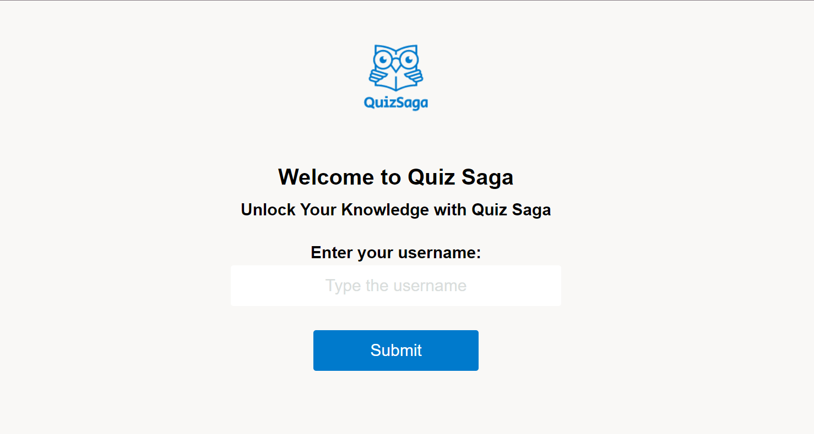
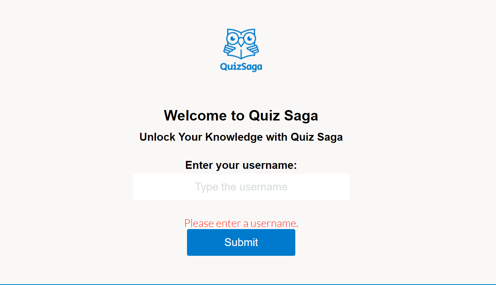
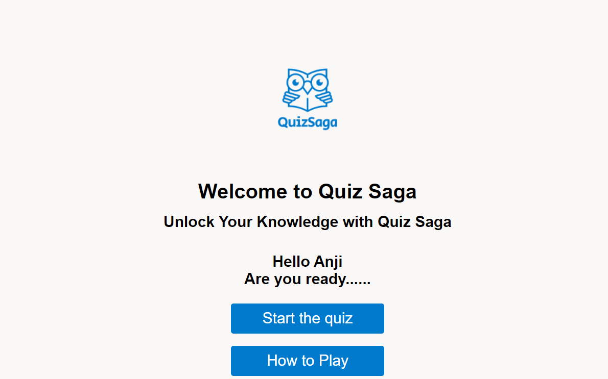
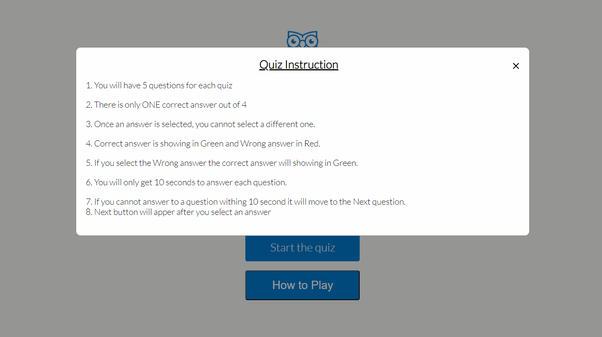
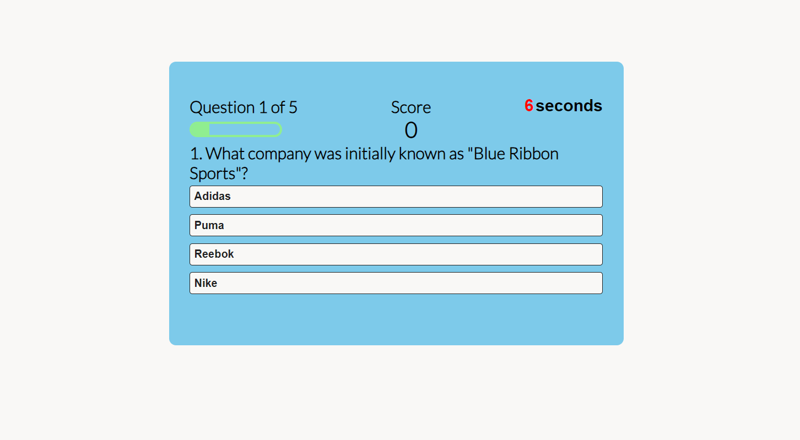
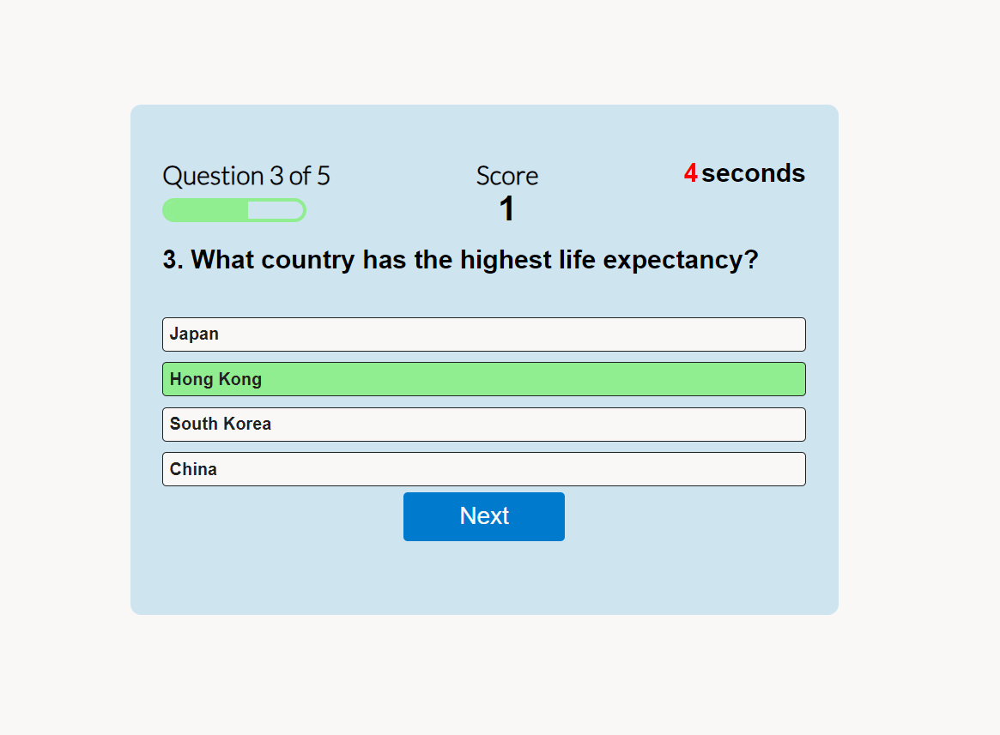
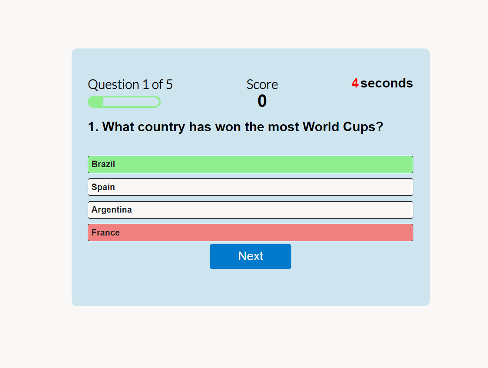
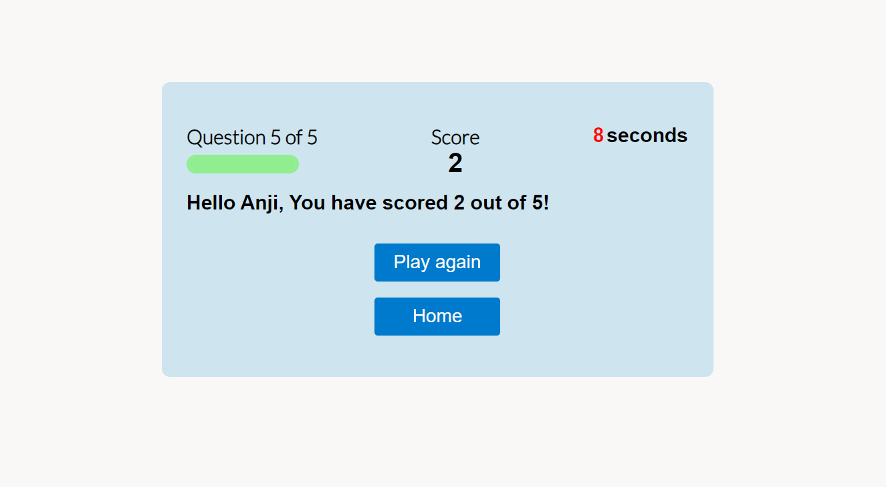

# Qize Saga

## Code Institute - Second Milestone Project: JavaScript Essentials Portfolio Project.

This website was developed to showcase my ability to design and create a static website. And to showcase my proficiency and understanding of JavaScript concepts and skills.

Quiz Saga is a multiple-choice online game that is engaging and educational. Players can test their knowledge in different areas while having fun. 

# Table of Contents
- [Qize Saga](#qize-saga)
  - [Code Institute - Second Milestone Project: JavaScript Essentials Portfolio Project.](#code-institute---second-milestone-project-javascript-essentials-portfolio-project)
- [Table of Contents](#table-of-contents)
  - [Demo](#demo)
    - [A live demo to the website can be found here](#a-live-demo-to-the-website-can-be-found-here)
  - [UX](#ux)
  - [User stories](#user-stories)
    - [Strategy](#strategy)
    - [Scope](#scope)
    - [Structure](#structure)
    - [Skeleton](#skeleton)
    - [Surface](#surface)
  - [Technologies](#technologies)
  - [Features](#features)
    - [Existing Features](#existing-features)
    - [Features Left to Implement](#features-left-to-implement)
  - [Testing](#testing)
    - [Validator Testing](#validator-testing)
    - [Bugs](#bugs)
  - [Deployment](#deployment)
  - [Credits](#credits)
    - [Content](#content)
    - [Media](#media)
    - [Acknowledgements](#acknowledgements)

## Demo

### A live demo to the website can be found [here](https://anjalee-kulasinghe.github.io/portfolio-project2-quiz-saga/)

## UX
The users are the players who are interested in playing the quiz game. Players can be in any age group. Since Quiz Saga is a multiple-choice general knowledge game, players can improve their general knowledge since the correct answer is displayed.

## User stories
As the sole developer of this website, my goal is to develop an online game that is engaging and educational. Players can test their knowledge in different areas while having fun.
I came up with the following points, which are applicable to the users:

- As a user, I want to understand the purpose of this website quickly and easily.
- As a user, I want to easily navigate this website (by using a mouse, a keyboard, or a touch screen).
- As a user, I want interactive learning.
- As a user, I want to see questions with varied topics, which will make the quiz more interesting and improve knowledge.
- As a user, I want to have fun while learning, making the educational process enjoyable.
- As a user, I want the game to offer challenges that keep users engaged, motivated, and eager to learn.
- As a user, I want to receive instant feedback on their answers, helping them learn from their mistakes.
- As a user, I want the interface to be intuitive and user-friendly, ensuring a smooth and enjoyable experience.
- As a user, I want clear instructions on how to play the game and access resources.

### Strategy
The goal is to create a well-functioning online quiz website that not only meets users' needs but also keeps them engaged, informed, and entertained while learning.

### Scope
As the developer, I wanted to provide an engaging and interactive platform for players to test their knowledge on various subjects. By creating a user-friendly, visually appealing, and mobile-responsive interface that helps the user experience a seamless game, by offering a diverse range of quizzes to cater to diverse interests and skill levels, and by providing instant feedback to motivate continuous participation and learning.

### Structure
I followed the simple layout so the interface would be user-friendly. Game instructions are given before the quiz starts. All questions are multiple-choice questions, and there is only one answer. At the top of the quiz window, the current question answer is shown with the progress bar, score, and timer visible to the player, so the player can easily keep track.

**Website Sections:**
1. **_Home / Landing page:_** A welcome message to the Quiz Saga and let the user select a user name. A message will display along with the given user name by the player to make it a little bit personal to the player and explain the two buttons.
2. **_Game page:_** The page will display the quiz questions (five questions for a single quiz), and at the end of the quiz, the player can know the total score and decide whether to play again or go to the home page.
3. **_Footer:_** This is not the main section of the website but rather an ending to the website with social media links and copywriting information.

### Skeleton
The website is designed to be clear and simple. And the site has a simple structure with hierarchical flows from top to bottom.

**Wireframe**
The wireframe is designed using Balsamiq software. The first draft was edited with the guidance of the mentor. The site was built with two main pages, and the wireframe was designed to focus on each page. The game page focuses on the single question and the result. I have decided not to use the navigation, which I have included in the wireframe design.

My wireframe design in the [(pdf format)](assets/readme-assets/wireFrame.pdf)

### Surface
I have selected flat colors for the Quiz Saga website. The purpose of using flat colors for the website is to keep it simple, not to make the player disturbed by the background, but also to make it more user-friendly to the player.
The main colors include shades of white and blue, along with black for the text.

_Main color palette_

## Technologies
1. HTML - To create a basic site.
2. CSS - To create a nice, standout front-end and to give a great user experience.
3. JavaScript - To enabling the creation of dynamic, interactive, and feature-rich websites. 
4. Balsamiq - To create a wireframe.

## Features
### Existing Features
* **Home**
  - Used a flat background color. Included is the logo and a message to welcome you to the Quiz Saga page.
  - There is a text box for the user to enter the user name.
  - Submit button will guide you to the next page or section of the website. The player can see an Error message if they try to satrt the game without entering a User Name.
  

* **Introduction**
  - In the introduction section, on the top logo, the same welcome message is displayed.
  - Below the welcome message, a greeting to the player is given with the user name entered by the player.
  - Below the greeting message, two buttons are given to the player.
    - Start the quiz: will direct the player to the quiz.
    - How to play: give the user quiz instructions. How to play the quiz

- **Start the quiz**
  - In the quiz section, on the top left side, the question progress bar is displayed. In the middle, the player's current score and the right timer for each question are given. The timer is set to 10 seconds.
  - Below the header area, a question is displayed along with the four answer choices. The player is allowed to select only one answer. After selecting the answer, the Next button will be displayed to the user.
  - Correct answer will be highlighted in green.
  - If the user selects the wrong answer, the wrong answer is highlighted in red, and at the same time, the correct answer is highlighted in green.
  - When the user selects an answer, the select option will be disabled. Accordingly, the question progress bar and the score will change, and the timer will reset to the next question.
  - If the user does not select an answer, it will automatically direct the player to the next question.

- **End the quiz**
  - At the end of the game, the player can see the total score that has been scored with the username the player has given and two buttons.
  - _Play again:_ Direct the player to play the quiz again. Will provide five new questions for the user.
  - _Home:_ Go to the start page, where users can start the game as new users.

- **Footer**
  - This section includes the social media links through which players can reach me. Below is copywriting information for the Quiz Saga website of Anjalee Kulasinghe.

### Features Left to Implement
In the future, 
* I would like to make the quiz a little longer.
* I would like to add the categories and let the player select the category they would like to play in.
* I would like to give the player the total time it took them to complete the quiz.
* I would like to develop the feature to store the scores of the players and let the players do a comparison of where they are with the score.

## Testing
* I tested the site, and it works in different web browsers: Chrome, Firefox, and Microsoft Edge.
* On mobile devices, I tested the my site on a Samsung Galaxy S23 Ultra with the Samsung browser and an iPhone SE with the Safari browser.
* I confirmed that the site is responsive and functions on different screen sizes using the devtools device toolbar.
* I confirmed that the all content are readable and easy to understand.
* I confirmed that the buttons works: it requires entries in every field, only accepts an email in the email field, and both the submit and reset buttons work.

### Validator Testing
* **HTML**
  No errors were returned when passing through the official [W3C validator for index page](assets/readme-assets/indexPage_validator_result_html.PNG) as well as for the [W3C validator for game page](assets/readme-assets/gamePage_validator_result_html.PNG)

* **CSS**
  No errors were found when passing through the official [(Jigsaw) validator](assets/readme-assets/css-validator_result.PNG)
  
* **Accessibility**
  I confirmed that the colors and fonts chosen are easy to read and accessible by running it through [Lighthouse DevTools](assets/readme-assets/site_accessibility.PNG)

### Bugs
* **Solved bugs**
  * When I deployed my project to GitHub pages, I found that my project was broken; the links to the other files (CSS and images) did not work.
  * I have used the file paths in the following way:
        `<link rel="stylesheet" href="./assets/css/style.css">` 
  * After removing './' to the start of the file path fixed the problem.
        `<link rel="stylesheet" href="assets/css/style.css">`
  * When I was inspecting the code in the console tab, I saw the error `Uncaught TypeError: Cannot set properties of null (setting 'onclick')`. With the help of the Tutor Assistance team, I separated the script related to the index page and the script related to the game page into two different script pages.
  * When I validated the input field, the submit button did not call the greeting function. In the submit button variable I created, I was calling the In the submit button variable I created, I was calling the `querySelector("btn-submit")`. I have to change the .btn-submit to #user-name to make the greetings() function work properly.
  * Since there were few variables created using the same ID, at the end I removed the references and used a single variable under the guidance of the mentor. 
  * When I was doing the modification to the script file related to the game, it did not collect the questions and answers from the array. The problem was overwriting the original array every time  started the quiz. To fix the problem, I had to store the randomly selected five questions in a separate array called `selectedQuestions`.
  * Countdown timer did not stop when the user selected an answer. I added `clearInterval` to clear the timer when the player selects an answer and to ensure that the timer stops in that case. 

## Deployment
* The site was deployed to Git Hub pages using the following steps:
  * In the Github repository, the Stetting tab.
  * Under General, navigate to Code and Automation and select 'Pages'.
  * In the Build and Deployment section for Source, select 'Deploy from a branch' from the drop-down list.
  * For Branch, select 'main' from the drop-down list and Save.
  * On the top of the page, the link to the complete website is provided.
  
  - The deployed site will update automatically upon new commits to the master branch.

## Credits
### Content
* The greeting message with the user name given idea and part for the code was taken from [Keith Paterson](https://www.youtube.com/watch?v=79WRPIknVHs&list=PLuumbB6r824HbAiVGGK_s3lcFsqmG9VyL&index=2).
* The code for [How TO - CSS/JS Modal](https://www.w3schools.com/howto/howto_css_modals.asp) from www.w3schools.com.
* To add the progress bar and the score at the top of the quiz window, I took the idea from the [Brian Design](https://www.youtube.com/watch?v=f4fB9Xg2JEY) YouTude vedio.
* To hide the Next button until the user gives an answer and highlight the correct answer when the wrong answer is selected, I took the idea and the code from the [GreatStack](https://www.youtube.com/watch?v=PBcqGxrr9g8&list=PLuumbB6r824HbAiVGGK_s3lcFsqmG9VyL&index=3) YouTude vedio.
* For the timer, I took the idea from the [Invention Tricks](https://www.youtube.com/watch?v=WHHYz8rZmDU&list=PLuumbB6r824HbAiVGGK_s3lcFsqmG9VyL&index=4) YouTude vedio.
* To get five random questions from a given list of question arrays in JaveScript, I took the idea from the [Stackoverflow](https://stackoverflow.com/questions/75044463/get-5-random-questions-from-a-list-of-10-in-js) website.
* The questions are taken from [Mentimeter](https://www.mentimeter.com/blog/audience-energizers/55-free-trivia-and-fun-quiz-question-templates#general-knowledge) and [Radiotimes](https://www.radiotimes.com/tv/tv-listings/) websites.
* The footer section code and the ReadMe file deployment section were taken from my 1st project [Online CV](https://github.com/anjalee-kulasinghe/portfolio-project1-cv-website/tree/main).

### Media
The logo was created with the help of the website [FreeLogoDesign](https://www.freelogodesign.org/manager/logo/0999ceaa389b4fa49d1bbd57c86cfdc4/showcase).

### Acknowledgements
* Inspirational support from [Trivia_Quiz](https://constantinadrian.github.io/Trivia_Quiz/index.html#categories) project.
* The the Code Institute Tutor Assistance for helping me with the correct guidance.
* Last but not least, my mentor, Medale Oluwafemi, for his invaluable guidance.